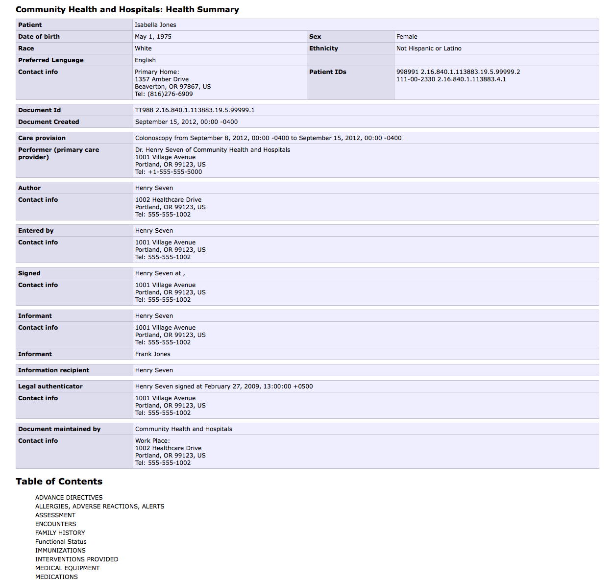
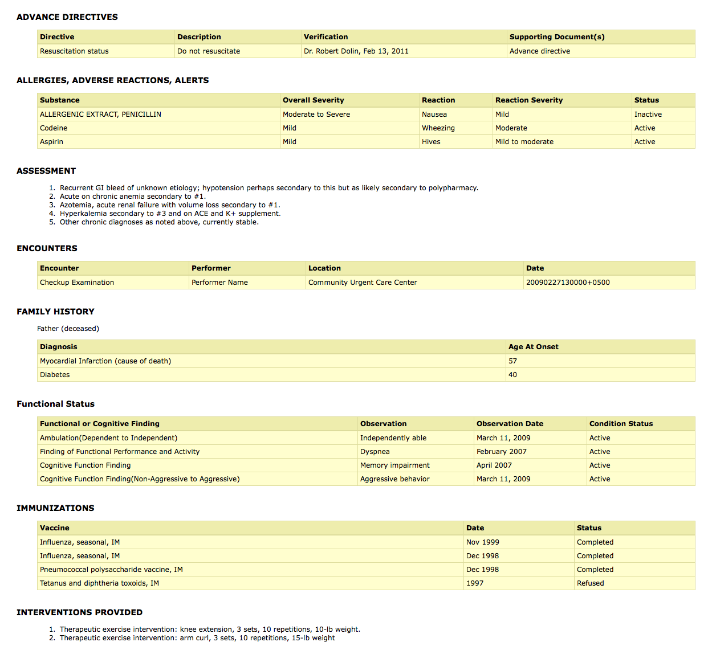

# A prettier stylesheet for HL7 CDA documents.

The standard CDA stylesheet isn't all that pretty to look at. We aim to fix that.

This style sheet is based off off [Josh Mandel's version of CDA.xsl with security fixes](http://motorcycleguy.blogspot.com/2014/04/hl7-cda-stylesheet-patches.html) but with some modifications:

* A prettier aesthetic
* Display of additional header fields
* Conversion of languages from codes to language names
* Bug fixes

Fixes and enhancements are more than welcome, please submit a pull request. Licensed under the Apache License, Version 2.0, see xsl file for details. 

Here's some screenshots using one of the example CDA documents using the pretty stylesheet:

